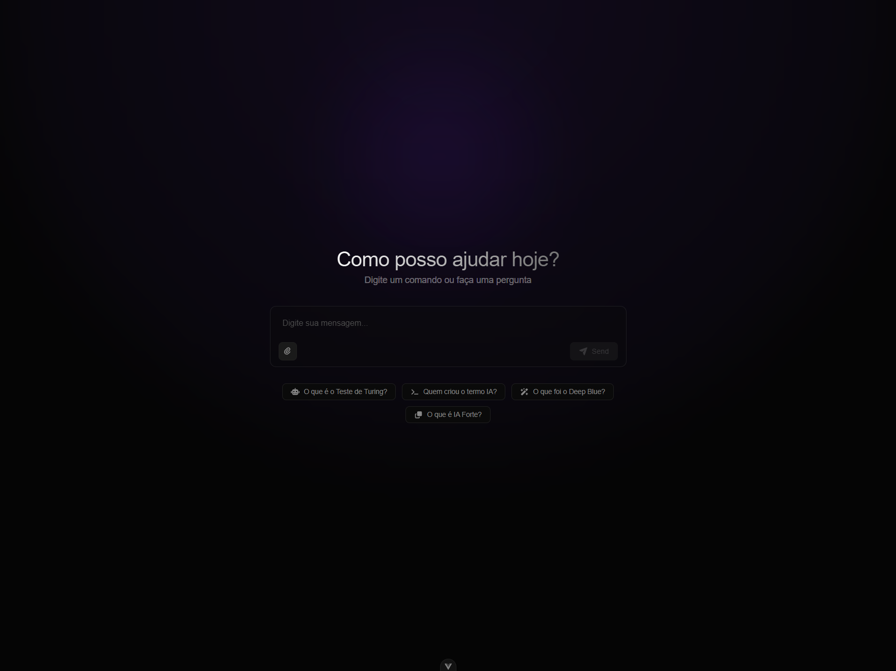

# 🧠 Teste Técnico: Agente de IA com RAG e LangChain

Este projeto é a solução para o desafio técnico de **Desenvolvedor de IA**, desenvolvendo um agente de IA completo capaz de realizar RAG (Retrieval-Augmented Generation) com documentos enviados pelo usuário e conteúdo extraído da web.

A solução foi construída com foco em **modularidade**, **performance** (assincronismo) e **arquitetura limpa**, utilizando o framework Litestar e o ecossistema LangChain/LangGraph.


---

## 🎥 Demo



> **Assista ao vídeo demonstrativo:** [assets/2026-01-21-00-10-40.mp4](assets/2026-01-21-00-10-40.mp4)  
> _Nota: O vídeo não possui áudio, sendo apenas uma demonstração visual do sistema em funcionamento._

---

## 💻 Requisitos de Sistema (Hardware)

⚠️ **Atenção:** Como todo o processamento de IA (LLM + Embeddings + OCR) é executado **localmente na CPU** (para garantir compatibilidade universal sem depender de GPU dedicada), o projeto exige recursos consideráveis:

- **Memória RAM**: Mínimo de **16GB**.
  - _Motivo:_ O Docker precisa alocar memória para o modelo LLM, o modelo de embeddings, o banco de dados vetorial, e os serviços de aplicação simultaneamente.
- **CPU**: Processador moderno multi-core.
  - _Motivo:_ A inferência do modelo Qwen, o modelo de embeddings e o OCR do Tesseract são tarefas intensivas de CPU.
- **Armazenamento**: ~10GB de espaço livre (Imagens Docker + pesos dos modelos).

---

## 🏛️ Arquitetura da API (Backend)

O coração do projeto é a API desenvolvida em **Python 3.13** utilizando **Litestar**.

### Estrutura de Pastas Detalhada

```
api/
├── src/
│   ├── app.py                  # Ponto de entrada (Entrypoint) e configuração da App
│   ├── logging_config.py       # Configuração centralizada de Logs (Singleton)
│   │
│   ├── controllers/            # Camada de Apresentação (HTTP Handlers)
│   │   ├── chat_controller.py      # Gerencia SSE stream e uploads do chat
│   │   └── scrape_controller.py    # Gerencia requisições de scraping
│   │
│   ├── models/                 # Camada de Dados (Pydantic Models)
│   │   ├── chat_model.py           # Schemas de entrada/saída do chat
│   │   └── scrape_model.py         # Schemas de requisições de scrape
│   │
│   ├── services/               # Camada de Negócio (Core Logic)
│   │   ├── chat_service.py         # Orquestra o fluxo de mensagem -> agente -> resposta
│   │   ├── ingestion_service.py    # Processamento de arquivos (PDF, MarkItDown, OCR)
│   │   ├── scraper_service.py      # Lógica de extração e limpeza da Web
│   │   ├── pgvector_service.py     # Abstração do Banco Vetorial (CRUD de embeddings)
│   │   │
│   │   └── agent/              # Módulo do Agente Inteligente
│   │       ├── agent.py            # Definição do grafo (LangGraph) e LLM
│   │       ├── tools.py            # Ferramentas disponíveis (Search Tool)
│   │       └── prompt.py           # Engenharia de Prompt e Regras de Sistema
│   │
│   └── ...
├── Dockerfile                  # Build otimizado em multi-stage
└── pyproject.toml              # Gerenciamento de dependências (UV/Poetry standard)
```

### Componentes Chave

#### 1. Agente Inteligente (`src/services/agent/`)

Utilizamos **LangChain/LangGraph** para criar um agente do tipo **ReAct** (Reasoning + Acting).

- **Graph**: O agente não é uma corrente linear (Chain), mas um grafo de estados. Ele decide dinamicamente se precisa consultar uma ferramenta ou se pode responder diretamente.
- **Dynamic Prompting**: O _System Prompt_ não é estático. A cada interação, injetamos a lista atualizada de arquivos disponíveis na base de conhecimento, permitindo que o agente saiba exatamente o que pode consultar.
- **LLM**: Configurado para usar **Ollama** executando o modelo `qwen3:4b` com temperatura baixa (0.1) para reduzir alucinações.

#### 2. Serviço de Ingestão (`IngestionService`)

Responsável por transformar dados brutos em conhecimento estruturado.

- **Pipeline de Processamento**:
  1.  Identifica o tipo MIME do arquivo.
  2.  Seleciona o extrator: `pdfplumber` (PDF), `pandas` (Excel/CSV), `markitdown` (Docs/Web) ou `pytesseract` (Imagens).
  3.  **OCR Fallback**: Se for uma imagem, aplica OCR para extrair o texto.
  4.  **Chunking**: Utiliza `RecursiveCharacterTextSplitter` para quebrar o texto em pedaços semânticos (chunks) de 1000 tokens com overlap.

#### 3. Banco Vetorial (`PgVectorService`)

Abstração sobre o **PostgreSQL + PGVector**.

- **Embeddings**: Utiliza o modelo `sentence-transformers/paraphrase-multilingual-MiniLM-L12-v2` (HuggingFace) para gerar vetores de alta qualidade em Português.
- **Busca Híbrida**: Permite busca semântica filtrada por metadados (ex: buscar apenas dentro do arquivo "contrato.pdf").

---

## 🛠️ Stack Tecnológica

### Backend (API)

| Tecnologia         | Função           | Motificativa                                                                      |
| ------------------ | ---------------- | --------------------------------------------------------------------------------- |
| **Litestar**       | Web Framework    | Injeção de dependência robusta, validação automática de tipos, performance async. |
| **LangGraph**      | AI Orchestration | Permite fluxos cíclicos e controle de estado (memory) superior ao LangChain puro. |
| **LangChain**      | AI Utils         | Ferramentas de split de texto e abstração de modelos.                             |
| **Ollama**         | LLM Host         | Execução local de modelos open-source sem depender de API keys externas.          |
| **Pytesseract**    | OCR              | Extração de texto de imagens offline.                                             |
| **BeautifulSoup4** | Web Scraping     | Parsing eficiente de HTML estático (Wikipedia).                                   |

### Infraestrutura

| Serviço      | Container        | Descrição                                                 |
| ------------ | ---------------- | --------------------------------------------------------- |
| **API**      | `impar-api`      | Backend Python. Exposto na porta 8000.                    |
| **Frontend** | `impar-frontend` | Nginx servindo Vue.js. Exposto na porta 80.               |
| **Database** | `impar-postgres` | PostgreSQL 16 image oficial `pgvector/pgvector:pg16`.     |
| **LLM**      | `impar-ollama`   | Ollama service. Gerencia o download e execução do modelo. |

---

## 🚀 Guia de Instalação e Execução

### 1. Preparação

Certifique-se de ter o Docker Desktop instalado e rodando.

### 2. Execução (Docker Compose)

A aplicação foi desenhada para ser "Zero Config" na primeira execução.

```bash
# Clone o projeto
git clone https://github.com/vitorflopes/impar-ai-test.git
cd impar-ai-test

# Inicie os serviços (isso pode demorar na primeira vez)
docker-compose up --build
```

> **Nota do Build:** O build inicial irá baixar muitos arquivos. Tenha paciência.

### 3. Acessando

- **Chat**: http://localhost:80
- **Documentação API (Swagger UI)**: http://localhost:8000/schema/swagger

---

## ✅ Cobertura dos Requisitos

### Obrigatórios

- [x] **API Python (Litestar)**: Implementada.
- [x] **LangChain + LangGraph**: Implementados.
- [x] **PostgreSQL + PGVector**: Implementado e integrado.
- [x] **Ollama Local**: Integrado via Docker network.
- [x] **Ingestão de Arquivos**: PDF, CSV, Excel implementados.
- [x] **Scraping**: Endpoint `/scrape` funcional e integrado ao vector store.

### Bônus (Extras Entregues)

- [x] **Multiformato**: Suporte adicional a DOCX, PPTX, MD, JSON, HTML, TXT.
- [x] **OCR (Optical Character Recognition)**: Upload de imagens é processado e indexado.
- [x] **Interface Rica**: Chat com suporte a Markdown, streaming e histórico da conversa.
- [x] **Logging**: Logs estruturados em json-like format para observabilidade.

---

**Desenvolvido por Vitor Lopes**
